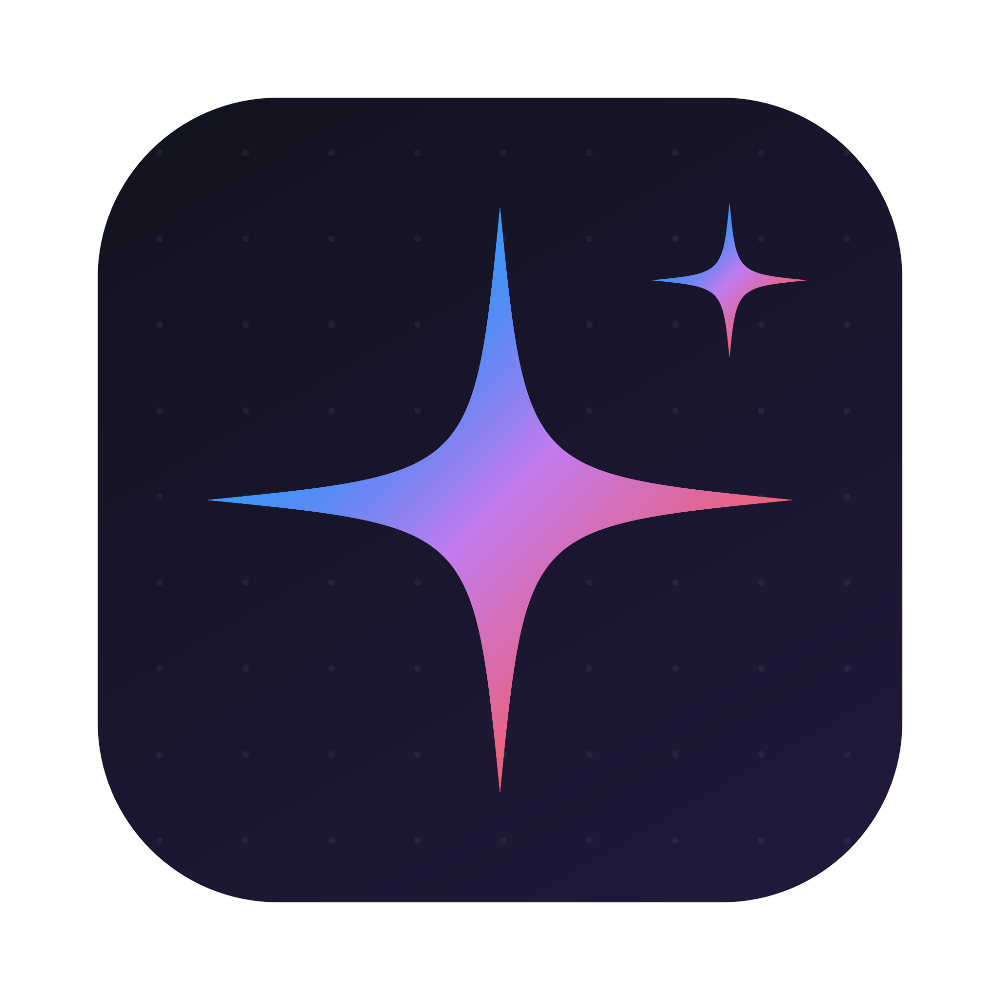
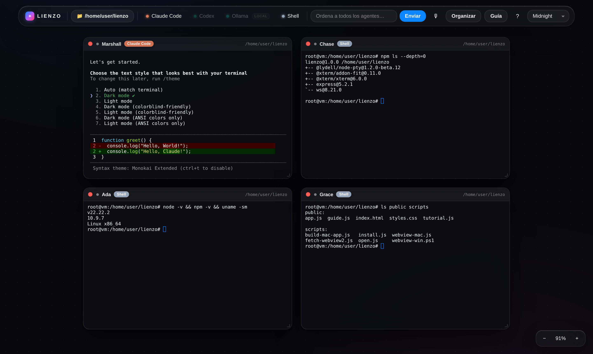
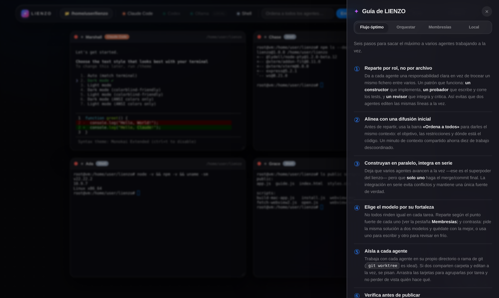
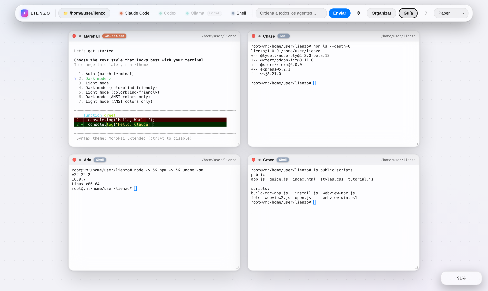
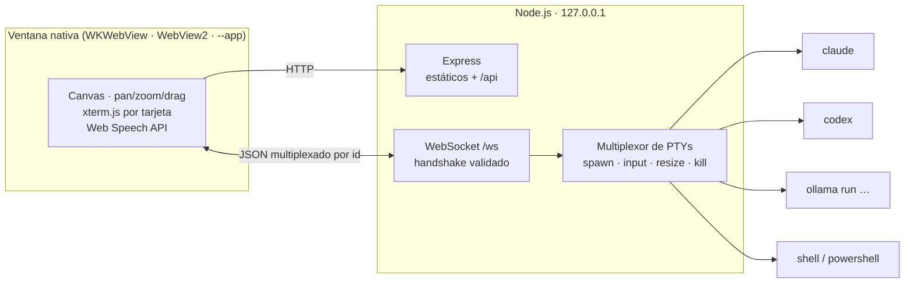

<div align="center">



# LIENZO ◩

**Comanda un ejército de agentes de IA en un solo lienzo.**

Claude Code, Codex y **modelos locales** (Ollama) corriendo en paralelo sobre un
canvas infinito, cada uno en su propio terminal real, dirigidos con texto o con tu voz.

*Tú diriges, ellos construyen, tú publicas.*

[](https://nodejs.org)
[](https://expressjs.com)
[](https://github.com/websockets/ws)
[](https://xtermjs.org)
[](#instalación)
[](LICENSE)
[](#instalación)

</div>



---

## El problema

Trabajar con agentes de IA en el terminal es trabajar **de uno en uno**: una pestaña,
un agente, una tarea. Cuando quieres que uno implemente, otro escriba los tests y un
tercero revise, acabas saltando entre ventanas, perdiendo el hilo de quién hace qué y
repitiendo el mismo contexto tres veces.

**LIENZO** convierte esa fila india en un **tablero**: cada agente es una tarjeta en un
canvas infinito, todos vivos y visibles a la vez, con una barra superior desde la que se
les da contexto común de una sola orden.

## Qué es

Una **app de escritorio local** (macOS, Windows y Linux) que abre ventana propia sin
navegador y sin instalar ejecutables: solo necesitas [Node.js 18+](https://nodejs.org).

- No es un wrapper de una API: cada tarjeta es un **proceso PTY real** con un terminal
  completo, así que dentro corre el CLI oficial de cada agente, con tu propia sesión.
- No cobra suscripción ni proxea nada: usa **las cuentas que ya tienes** y, si quieres,
  modelos **100 % locales** con Ollama.
- Todo ocurre en tu máquina, atado a `127.0.0.1`.

<table>
<tr>
<td width="50%"></td>
<td width="50%"></td>
</tr>
<tr>
<td align="center"><em>Guía integrada: flujo, orquestación, membresías y modelos locales</em></td>
<td align="center"><em>Cuatro temas; el terminal cambia de paleta con la interfaz</em></td>
</tr>
</table>

## Características

| | |
|---|---|
| 🗺️ **Canvas infinito** | Paneo con arrastre o rueda, zoom con ⌘/Ctrl + rueda, tarjetas arrastrables y redimensionables. |
| 🤖 **Agentes reales en paralelo** | Un proceso PTY independiente por tarjeta (xterm.js + `@lydell/node-pty`), detectados automáticamente en tu máquina. |
| 🎙 **Control por voz** | Web Speech API: `«Marshall, corre los tests»`, `«todos: describe tu estado»`, `«nuevo agente claude»`, `«organiza el lienzo»`. |
| 📣 **Difusión** | Una orden desde la barra superior llega a todos los agentes vivos: contexto común en un segundo. |
| 🧩 **Organizar con un clic** | Cuadrícula, fila, columna o cascada con animación y encuadre automático; separación, columnas y orden configurables y recordados. |
| 🖥️ **Modelos locales** | Botón Ollama con distintivo `local`: eliges modelo entre los que ya tienes descargados. Gratis, privados y sin conexión. |
| 📁 **Carpeta de trabajo** | Elige dónde nacen los agentes: será la carpeta que te pidan «confiar». |
| 🎨 **Cuatro temas** | Midnight, Carbon, Paper y Synthwave, con el terminal sincronizado. |
| 🧭 **Tutorial y guía** | Recorrido de coach-marks opcional (botón <kbd>?</kbd>) y panel de guía con cuatro pestañas. |
| 🪟 **Ventana nativa** | Sin Electron y sin navegador: WKWebView en macOS, WebView2 en Windows, modo `--app` en Linux. |

### Agentes soportados

| Agente | Binario | Instalación |
|---|---|---|
| Claude Code (Anthropic) | `claude` | `npm i -g @anthropic-ai/claude-code` |
| Codex (OpenAI/GPT) | `codex` | `npm i -g @openai/codex` |
| **Ollama (modelos locales)** | `ollama` | [ollama.com/download](https://ollama.com/download) |
| Shell / PowerShell | `$SHELL` / `powershell` | siempre disponible |

Los que no estén instalados aparecen deshabilitados en la barra; instala uno y reinicia
el servidor para activarlo. La primera vez, cada agente en la nube pide iniciar sesión
con tu propia cuenta dentro de su tarjeta.

> 🔑 **Claves de API** — si prefieres autenticar con una clave en vez de iniciar sesión,
> ponla en `~/.lienzo.env` (líneas `CLAVE=valor`, p. ej. `ANTHROPIC_API_KEY=…` u
> `OPENAI_API_KEY=…`). LIENZO se la pasa a todos los agentes aunque abras la app desde
> el Dock o un acceso directo, donde los `export` de tu shell no llegan.

## Instalación

> 🪟 **¿Windows?** Sigue la **[guía paso a paso para Windows »](docs/WINDOWS.md)** —
> de cero, sin saber programar, explicando qué app abrir y qué comando escribir.

Con [Node.js 18+](https://nodejs.org), en una terminal (macOS/Linux) o en **PowerShell**:

```bash
git clone https://github.com/Gian-DS1/lienzo.git
cd lienzo
npm install        # instala dependencias y crea el acceso directo automáticamente
```

`npm install` ejecuta `npm run setup`, que crea un **acceso directo nativo** apuntando a
este repo y a tu instalación de Node (sin rutas fijas):

| Sistema | Qué crea | Cómo abrirlo |
|---|---|---|
| **macOS** | `~/Applications/LIENZO.app` | Launchpad / Spotlight / Dock |
| **Windows** | Acceso directo en Escritorio y menú Inicio | Doble clic en **LIENZO** |
| **Linux** | Entrada `LIENZO` en el menú de apps | Búscala en tu lanzador |

Al abrirlo, LIENZO arranca su servidor local (si no está ya corriendo) y se muestra como
un programa con **ventana propia**:

- **macOS** — ventana nativa con el WebKit del sistema. El setup la compila con
  `osacompile` (herramienta incluida en macOS, sin código nativo) a una `.app` propia,
  así la barra de menús y el Dock muestran **LIENZO**.
- **Windows** — ventana nativa WinForms con **WebView2** (runtime de Microsoft
  preinstalado en Windows 11 y casi todo Windows 10), creada desde PowerShell; las DLLs
  oficiales del SDK las descarga el setup a `webview2/`. Si faltara el runtime, cae solo
  a Edge en modo app.
- **Linux** — modo `--app` de Chromium/Chrome, o el navegador por defecto.

¿Prefieres otra ventana? Añade `LIENZO_WINDOW=chrome` (modo app de Chrome/Brave/Edge) o
`LIENZO_WINDOW=browser` (navegador por defecto) a `~/.lienzo.env`.

Si prefieres la terminal: `npm start` y abre <http://localhost:3000>
(otro puerto: `PORT=3001 npm start`, o `$env:PORT=3001; npm start` en PowerShell).

> **Node.js es el único requisito.** `@lydell/node-pty` incluye binarios precompilados
> para Windows (x64/ARM), macOS y Linux: **no hace falta compilar nada** ni tener
> herramientas de build.
>
> 💡 Clona el proyecto en una **carpeta local normal** (p. ej. `C:\Users\tú\lienzo` o
> `~/Proyectos`), **no** dentro de OneDrive/iCloud: los sincronizadores pueden bloquear
> archivos y dar errores de acceso.

## Uso

1. Elige la **carpeta de trabajo** en la barra (será la que los agentes te pidan confiar).
2. Invoca agentes con los botones de la barra: cada uno aparece como tarjeta con nombre
   de tripulación (Marshall, Chase, Ada, Grace, Linus…) para poder llamarlo por voz.
3. Escribe en cada terminal como en cualquier consola, o usa la **difusión** para dar
   una misma orden a todos.
4. Pulsa 🎙 y habla; <kbd>Organizar</kbd> para alinearlos; <kbd>Guía</kbd> para el flujo
   recomendado de trabajo con varios agentes.

| Acción | Cómo |
|---|---|
| Paneo | Arrastra el fondo o usa la rueda |
| Zoom | ⌘/Ctrl + rueda, o los botones −/+ |
| Mover / redimensionar tarjeta | Arrastra la cabecera / la esquina inferior derecha |
| Difundir orden | Barra superior → *Ordena a todos los agentes…* |
| Voz | Botón 🎙 (requiere Chrome o Safari) |
| Organizar | Botón <kbd>Organizar</kbd> → cuadrícula · fila · columna · cascada |
| Tutorial | Botón <kbd>?</kbd> (←/→/Esc para navegar) |

> El reconocimiento de voz usa la Web Speech API, que las ventanas nativas de
> macOS/Windows no incluyen: para dictar, abre LIENZO con `LIENZO_WINDOW=chrome`.

### Modelos locales en tres pasos

```bash
# 1. Instala Ollama desde https://ollama.com/download  (Windows/macOS/Linux)
# 2. Descarga un modelo (para programar: qwen2.5-coder, deepseek-coder-v2, codellama)
ollama pull llama3
# 3. Abre LIENZO, pulsa «Ollama» y elige el modelo. Listo.
```

Los modelos grandes piden más RAM (~8 GB para 7B, ~16 GB para 13B); si va lento, usa uno
más pequeño (`phi3`, `mistral`) o una variante cuantizada (`llama3:8b-instruct-q4_0`).
Detalle completo dentro de la app: **Guía → Local**.

## Arquitectura



Una sola conexión WebSocket transporta todos los terminales, multiplexados por `id` de
agente: cada mensaje lleva su destinatario, así que abrir la décima tarjeta no abre un
décimo socket.

```
server.js                  Express + WebSocket. Detección de CLIs multiplataforma y
                           multiplexado de PTYs (@lydell/node-pty) por conexión.
scripts/open.js            Lanzador: arranca el servidor y abre la ventana de la app.
scripts/webview-mac.js     Ventana nativa de macOS: WKWebView del sistema (JXA).
scripts/build-mac-app.js   Compila esa ventana a una .app con osacompile (Dock = «LIENZO»).
scripts/webview-win.ps1    Ventana nativa de Windows: WinForms + WebView2 vía PowerShell.
scripts/fetch-webview2.js  Descarga las DLLs oficiales del SDK de WebView2 (NuGet).
scripts/install.js         Crea el acceso directo nativo del sistema (npm run setup).
public/index.html          Barra superior, viewport, controles de zoom, chip de voz.
public/app.js              Canvas, terminales, difusión, voz y temas.
public/tutorial.js         Recorrido de coach-marks.
public/guide.js            Panel de guía (flujo · orquestar · membresías · local).
public/styles.css          Temas y componentes vía variables CSS.
assets/                    Icono en PNG/.icns/.ico y su generador en Swift.
```

Reinstalar el acceso directo en cualquier momento: `npm run setup`.

## Diseño

Lenguaje visual inspirado en el **Liquid Glass** de Apple (WWDC25): superficies
translúcidas con `backdrop-filter` (blur + saturación), bordes de luz de 0.5px, brillos
especulares y sombras en capas. Las animaciones usan curvas de resorte (`cubic-bezier`)
al estilo iOS; las tarjetas activas muestran un **borde de gradiente cónico rotatorio**,
y el modo voz enciende un **resplandor de borde de pantalla completo**. El icono
(chispa en gradiente sobre squircle oscuro) se genera con `assets/make-icon.swift` y se
exporta a `.icns` (macOS) y `.ico` (Windows).

Todo el front es **HTML, CSS y JavaScript sin framework ni paso de build**: no hay
bundler, no hay `dist/`; lo que lees en `public/` es lo que corre el navegador.

## Seguridad

LIENZO abre terminales reales, así que el servidor está pensado para uso local:

- **Solo loopback** — se vincula a `127.0.0.1`, nunca a la red local. Para exponerlo a
  propósito, arranca con `HOST=0.0.0.0` (bajo tu responsabilidad).
- **Handshake WebSocket validado** — se rechazan las conexiones cuyo `Host` u `Origin`
  no sean `localhost`/`127.0.0.1` (o, con un `HOST` no-loopback, las direcciones reales
  de la máquina). Eso bloquea el *cross-site WebSocket hijacking* (una web maliciosa
  abriendo `ws://localhost:3000`) y el *DNS rebinding*.
- **Sin claves en el repo** — las credenciales viven en `~/.lienzo.env`, fuera del
  proyecto, y cada CLI se autentica con su propia cuenta como en un terminal normal.

## Retos técnicos resueltos

Los problemas que hicieron interesante el proyecto, y cómo se resolvieron:

- **Ventana de escritorio sin Electron ni binarios propios.** Empaquetar un Chromium
  entero por unos cientos de KB de código no compensa. Cada sistema aporta su webview:
  `osacompile`
  genera una `.app` real en macOS, PowerShell levanta WinForms + WebView2 en Windows, y
  Linux cae al modo `--app`. Instalar sigue siendo `npm install`.
- **Detectar CLIs cuando no hay PATH.** Una app lanzada desde el Dock o un acceso directo
  hereda un entorno mínimo, así que `which` no basta: se prueban primero las rutas
  típicas de npm global por plataforma (`%APPDATA%\npm`, junto a `node`, `/usr/local/bin`)
  y `which`/`where` queda como último recurso.
- **N terminales, un socket.** Multiplexar todos los PTYs por `id` sobre una única
  conexión evita el coste de un socket por tarjeta y mantiene el orden de los eventos
  (`spawn`/`data`/`exit`) por agente.
- **Superficie de ataque de un shell en localhost.** Un servidor que ejecuta comandos y
  escucha en un puerto conocido es un objetivo clásico: de ahí el bind a loopback y la
  validación de `Host`/`Origin` en el handshake, no solo en el HTTP.
- **Fallos reales en máquinas reales.** Puerto ocupado con mensaje útil en vez de crash,
  arranque nativo arm64 en Apple Silicon (sin el aviso de «app Intel» ni Rosetta),
  permisos de micrófono en la ventana de macOS y barra responsive al ancho de la ventana.

## Estado y siguientes pasos

Funciona de punta a punta en macOS, Windows y Linux. En la lista:

- [ ] Guardar y restaurar la disposición del lienzo entre sesiones.
- [ ] Historial de difusiones y plantillas de prompts reutilizables.
- [ ] Más agentes detectables sin tocar código (definiciones declarativas).
- [ ] Tests end-to-end del canvas y del multiplexado de PTYs.

## Licencia

[MIT](LICENSE) · Hecho por [**Gian-DS1**](https://github.com/Gian-DS1)
